# vigil: AI-powered suspicious activity detection

An agentic AML (anti-money-laundering) analyst over the IBM synthetic transaction dataset.
Ask it a question in plain English. It parses the intent, builds an execution plan on the spot,
invokes only the tools that question needs, scores the accounts involved, explains every flag in
terms of the rule or feature that fired, and recommends an escalation action.

> [!NOTE]
> The agent does not run a fixed pipeline. `"What data do we have?"` costs one `eda` call.
> `"Is customer 1004286A8 suspicious?"` skips EDA entirely and runs
> `feature_eng → anomaly → risk → explain` scoped to that one account. The execution summary
> panel shows what it chose and what it deliberately skipped, on every run.

| | |
|---|---|
| **Problem statement** | #1, AI-Powered Suspicious Activity Detection |
| **Dataset** | IBM *Synthetic Transaction Data for AML*, `HI-Small` split (Kaggle) |
| **Scale** | 5,078,345 transactions, 518,581 accounts, 0.102% laundering base rate |
| **Agent** | Hand-rolled tool-calling loop over Gemini, 5 ML tools plus escalation |
| **Detection** | Isolation Forest + LOF + z-score, blended by measured lift, over an 8-motif graph rules engine |
| **Interface** | FastAPI, React 19 + Vite, SQLite audit trail |
| **Tests** | 423 backend (pytest), 10 frontend (vitest) |

---

## Table of contents

- [Problem statement](#problem-statement)
- [Screenshots](#screenshots)
- [Solution approach](#solution-approach)
- [Dataset](#dataset)
- [Detection methodology](#detection-methodology)
- [Measured results](#measured-results)
- [Tech stack](#tech-stack)
- [Setup](#setup)
- [Usage](#usage)
- [API](#api)
- [Project structure](#project-structure)
- [Testing](#testing)
- [Known limitations](#known-limitations)
- [Data sources](#data-sources)
- [AI tool disclosure](#ai-tool-disclosure)

---

## Problem statement

Financial institutions are mandated by FinCEN, FATF and local regulators to run AML compliance
programmes. Traditional rule-based systems generate excessive false positives, which overwhelms
compliance teams, while sophisticated techniques like structuring, smurfing and layering evade
fixed rules entirely.

The brief asks for an autonomous agent that accepts a natural-language instruction, extracts
intent, filters and entities, dynamically constructs an execution plan, and invokes only the
internal tools that plan requires. It must perform EDA, engineer AML features, detect anomalies,
classify risk, explain each flag, and recommend `MONITOR`, `REVIEW` or `REPORT`.

### How each requirement is met

| Requirement | Where it lives | Notes |
|---|---|---|
| Parse intent, filters, entities, pattern type | `agent/loop.py` plus the `SYSTEM` prompt | Returned in `execution_summary.intent_detected` and `filters_applied` |
| Dynamic execution plan, not a fixed pipeline | `agent/loop.py::tool_calling_loop` | The model picks tools per turn; skipped tools are reported with a reason |
| EDA tool | `ml/eda.py` | A constrained DuckDB query catalogue, not free-form SQL from an LLM |
| Feature engineering tool | `ml/feature_eng.py` | On demand, scoped to an account or to a date/amount slice |
| Anomaly detection tool | `ml/anomaly.py` | 3 detectors plus the 8-motif rules engine, percentile-calibrated |
| Risk classification tool | `ml/risk.py` | `LOW`, `MEDIUM`, `HIGH`, `CRITICAL` from a tuned blend |
| Explanation layer | `ml/explain.py` | One template per motif, filled with the values that actually fired |
| Escalation recommendation | `ml/risk.py::ESCALATION_ACTIONS` | `LOW→MONITOR`, `MEDIUM/HIGH→REVIEW`, `CRITICAL→REPORT` |
| Structured, inspectable output | `schemas.py::AgentResult` | Pydantic-validated; malformed model output is dropped rather than rendered |
| Supporting charts, tables, metrics | `frontend/src/components/RiskCharts.tsx` | Evidence series are built deterministically from DuckDB, not from the model |

---

## Screenshots

### The interface

Three tabs (Investigate, Escalations, Dashboard), a running session counter in the sidebar, and a
light and dark theme. Everything below is one live session against the real dataset.

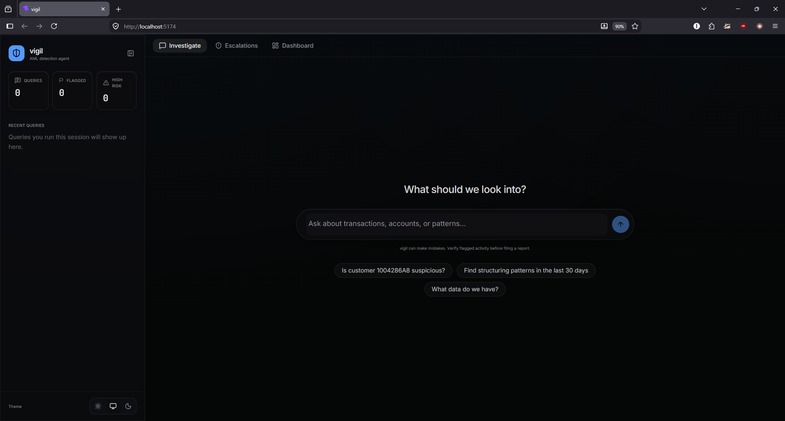

<details>
<summary>Light theme</summary>

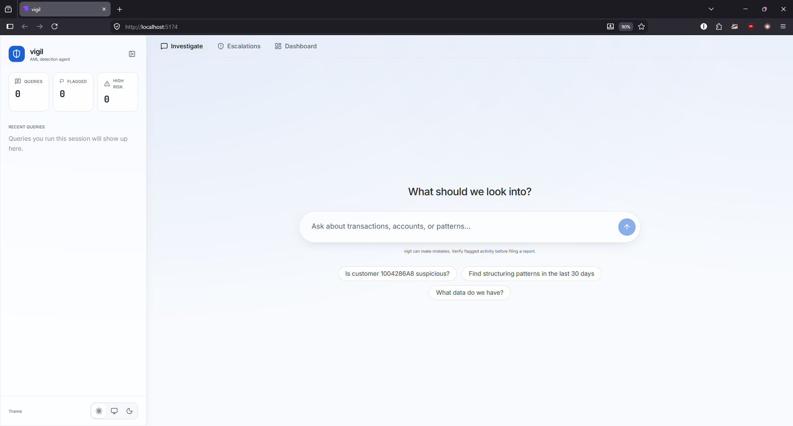

</details>

### Entity lookup

**Query:** `Is customer 1004286A8 suspicious?`

Intent resolves to `entity_risk_lookup`, the only filter is the account id, and the agent runs
`feature_eng → anomaly → risk → explain`. EDA is skipped and reported as skipped. The account
comes back at composite risk 0.86 with an anomaly score of 0.9974 and five motif hits, and the
answer names the shape it found: funds collected from 327 distinct senders and redistributed to
28, a 683.6% pass-through rate.

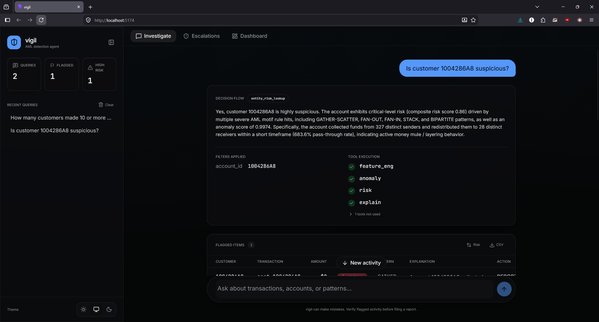

### Aggregate query

**Query:** `How many customers made 10 or more transactions under $10,000?`

The same agent, a completely different plan. Intent is `aggregate_eda`, the filters are
`amount_paid < 10000` and `min_transactions 10`, and `eda` runs alone while the four ML tools sit
unused. A threshold question is answered by aggregation, so the answer is a number: 91,575
customers. The charts at the top are evidence carried over from the previous run.

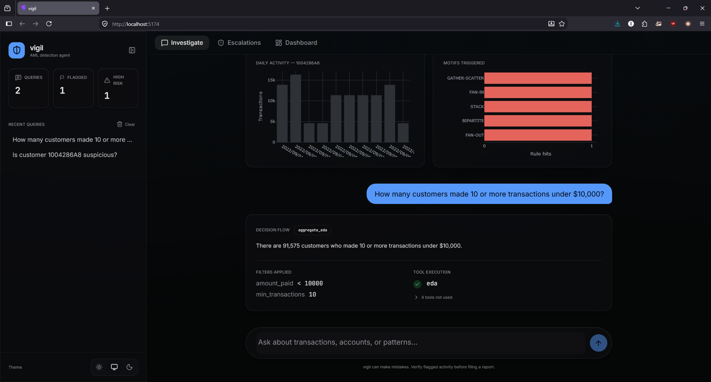

### Pattern search over a filtered slice

**Query:** `Find structuring patterns in the last 30 days`

Intent is `structuring_pattern_search`. The window resolves against the end of the data rather
than wall-clock now, giving a real `date_range` alongside `max_amount 5000` and
`velocity_window_days 30`. Account 1004286F0 is flagged HIGH on FAN-OUT for moving $17.4 billion
across 1,223 distinct receivers inside 24 hours, with a recommended action of REVIEW.

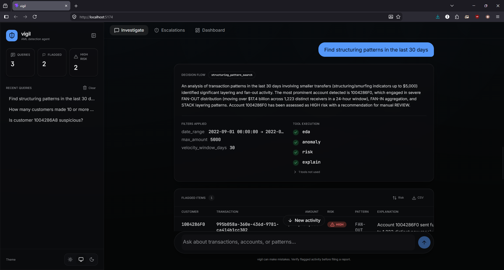

### Escalations, the audit trail

Every flag a human escalated, newest first, each joined back to the query that surfaced it. This
reads from SQLite rather than session state, so it survives a reload and spans conversations.
Escalating is one click, so it can also be undone: the flag survives and only the human action is
cleared.

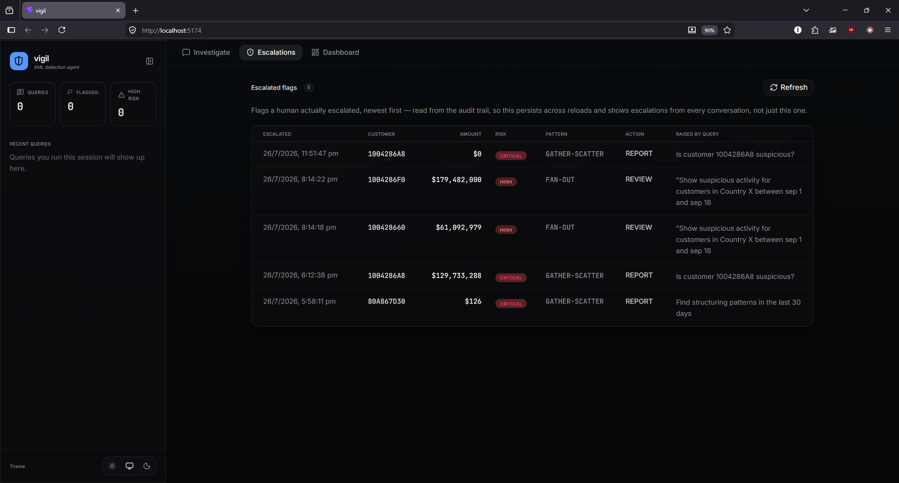

### Dashboard

Aggregates over every run ever recorded, not just the current conversation: 56 queries run, 21
items flagged, 5 escalated by an analyst (24% of flags acted on), plus flags by risk level, motifs
detected, tool usage and the most-flagged accounts.

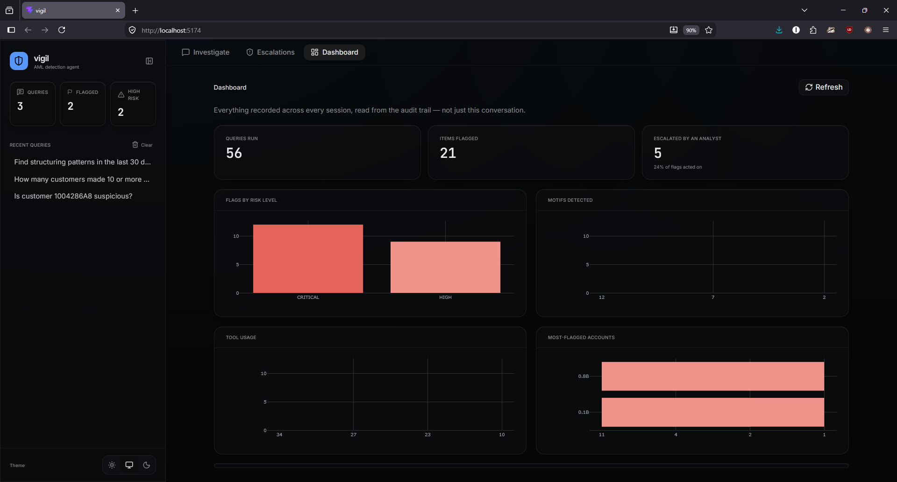

---

## Solution approach

### System architecture

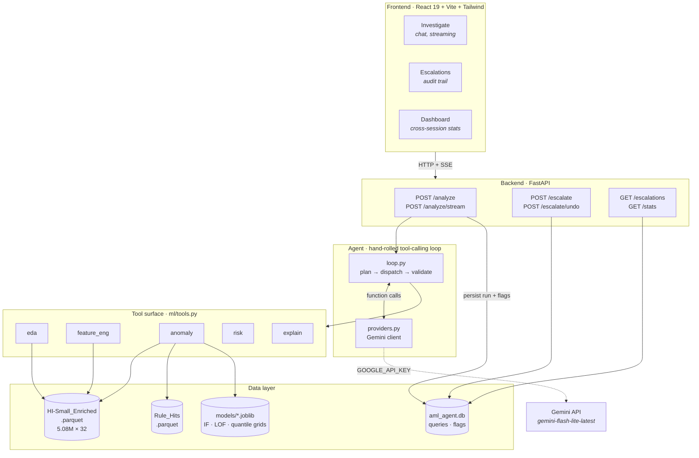

### The agent loop

The orchestration is our own code rather than a framework. `tool_calling_loop` runs up to 14 turns.
On each turn the model sees the tool schemas and decides what to call next. Every dispatch is
logged as it happens, and that log is both the transparency feed the UI renders and the audit
trail written to SQLite.

```mermaid
flowchart TD
    Q["Analyst query"] --> M{"Model turn<br/><i>sees TOOL_SCHEMAS</i>"}
    M -->|"tool_calls returned"| D["Dispatch each call<br/><i>ml/tools.py</i>"]
    D --> SAN["Sanitise result<br/>NaN → null, numpy → native,<br/>cap at 20k chars"]
    SAN --> REM["Remember risk/explain<br/>output per account"]
    REM --> EMIT["emit tool_start / tool_end<br/><i>→ SSE to the UI</i>"]
    EMIT --> M
    M -->|"no tool_calls"| P["Parse final JSON envelope<br/><i>tolerates fences and prose</i>"]
    M -->|"14 turns exhausted"| SAL["Salvage turn:<br/>tools closed, answer now"]
    SAL --> P
    P --> V{"flagged_items<br/>present?"}
    V -->|yes| VAL["Pydantic-validate each item<br/><i>drop malformed, never fail the run</i>"]
    V -->|"no, but risk&#40;&#41; ran"| SYN["Rebuild flags from<br/>actual tool output"]
    VAL --> EV["Build evidence series<br/><i>deterministic DuckDB, 0 extra model calls</i>"]
    SYN --> EV
    EV --> R["AgentResult →<br/>SQLite + frontend"]
```

Three failure modes shaped this design, and each of them cost a whole run before it was fixed.

The first is the model describing its findings in prose and then returning `flagged_items: []`. The
table renders empty and there is nothing to escalate, so the run reads as a failure even though the
analysis succeeded. Flags are now rebuilt from the `risk` and `explain` results the loop already
captured. `LOW` is deliberately excluded, because "we looked and it is fine" is a real answer and
turning it into a flag would fabricate a finding rather than recover one.

The second is the iteration budget running out mid-chain. `reply.text` is empty in that case, so
intent, filters, summary and flags all fall back to defaults, which turns a completed analysis into
a blank report. The loop now spends one final turn with the tools closed off.

The third is the model wrapping its JSON in prose or a code fence. A strict whole-string parse
discarded everything. Parsing now falls back to the first balanced top-level object, brace-counted
so that explanations containing braces do not truncate it.

### How one query routes

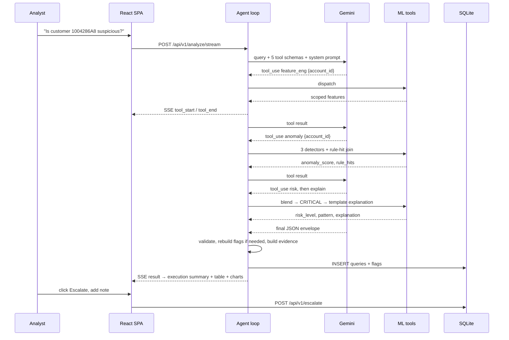

### Why these architectural calls

| Decision | Choice | Reason |
|---|---|---|
| Orchestration | Hand-rolled loop over the Gemini SDK | LangGraph was evaluated and rejected. A framework would have hidden the part the brief actually grades: writing the loop means the intent parsing, planning and dispatch are genuinely our code, and the transparency feed falls out of the dispatch log for free. |
| SDK boundary | All Gemini translation lives in `agent/providers.py` | `agent/loop.py` speaks one internal message shape and never imports the SDK, so the loop stays testable against a fake client with no network and no key. |
| Bulk storage | Parquet and DuckDB, no database server | 5.08M rows by 32 columns. Columnar scans over an embedded engine beat standing up Postgres for a read-only analytical workload. |
| Persisted history | Stdlib `sqlite3`, two tables | An audit trail is what makes a compliance product credible, and it turns `/escalate` from a stub into a real feature. One file, no server. |
| Detector fitting | Pre-fit at build time, artifacts written to `data/models/` | Fitting per call was rejected: a 70-row account scope produces a meaningless forest, and identical calls would return different scores. LOF uses `novelty=True` so it can score unseen rows. |
| Graph rules | Batch-precomputed to Parquet, joined at query time | Multi-hop motifs over 1,015,736 edges are too slow per call, and a cycle reaching outside the caller's scope is invisible to a scope-local pass, which is exactly the structure these rules exist to catch. |
| Explanations | One template per motif, tied to the firing rule | The brief asks for explanations tied to the detected pattern. SHAP or LIME would explain the detector's feature attribution instead of the motif, and the motif is what a compliance analyst acts on. |
| Tool result safety | Sanitised, size-capped, structured errors | Tools never raise across the boundary, NaN and numpy leaks are coerced, and a 20k-character cap keeps one `eda` over 5M rows from blowing the context window. |

---

## Dataset

### Source

The data is IBM's **Transactions for Anti Money Laundering (AML)** set, synthetic and published on
Kaggle, using the `HI-Small` split. Three files, all gitignored, since the derived output is 352 MB
and raw CSVs do not belong in a repository.

| File | Rows | Contents |
|---|---|---|
| `HI-Small_Trans.csv` | 5,078,345 | 11 columns: timestamp, from/to bank and account, amounts, currencies, payment format, `Is Laundering` |
| `HI-Small_accounts.csv` | 518,581 | account to bank, entity id, entity name |
| `HI-Small_Patterns.txt` | 3,209 rows in 370 blocks | `BEGIN/END LAUNDERING ATTEMPT - <TYPE>` blocks, group-level structural ground truth |

### What the data actually looks like

Profiled in `backend/notebooks/01_exploration.ipynb` and written up in `backend/docs/phase1.md`.
Everything below is measured rather than assumed.

- **Coverage:** 2022-09-01 to 2022-09-18, so 18 days at roughly 282k transactions per day. Day one
  is a 1.1M-transaction outlier, almost certainly a backfill artifact, and it is flagged rather
  than used raw as a volume baseline.
- **Class imbalance:** 5,073,168 normal against 5,177 laundering, a 0.102% positive rate. That is
  severe enough to make supervised classification unreliable as the sole method, which is why the
  detectors are unsupervised and the labels are used only for evaluation.
- **Payment Format is the strongest single separator:** 86.6% of laundering transactions are ACH
  against 11.8% of normal ones. Laundering has zero Wire and zero Reinvestment rows.
- **Amounts are heavy right-tailed:** mean $5.99M, median $1,411, maximum around $1.046 trillion.
  Every volume feature is `log1p`-transformed as a result.
- **The graph is sparse but hubbed:** 515,080 accounts across 1,015,736 unique sender-to-receiver
  edges, with out-degree median 1 and maximum 14,230. High-degree accounts are rare, and they are
  exactly the profile that fan-out, fan-in and gather-scatter target.
- **Self-loops are 11.6% of rows** (591,212). They are kept and flagged rather than dropped.
- **Join keys were verified empirically rather than assumed:** `Bank ID` overlap is 30,470 of
  30,470 (100%), and 100% of transaction-referenced accounts resolve in `accounts.csv`.
- **The pattern file is a subset, not an alternate labelling:** 3,209 rows against 5,177
  `Is Laundering` rows. It carries no shared key, so rows join back on the full field tuple. Both
  signals are kept as separate columns rather than conflated.

### How the dataset was mutated

One deterministic pass, `backend/scripts/enrich.py`, takes the raw CSVs to **5,078,345 rows by 32
columns**, a 352.6 MB Parquet file. Re-running it from the raw CSVs reproduces that file byte for
byte (sha256 `cc5da2ae…3dec2d`).

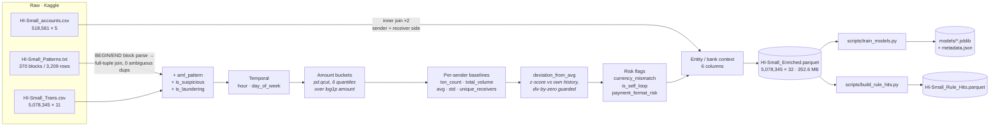

The 32 columns break down like this:

| Group | Count | Columns |
|---|---|---|
| Raw passthrough | 11 | `Timestamp`, `From Bank`, `From Account`, `To Bank`, `To Account`, `Amount Received`, `Receiving Currency`, `Amount Paid`, `Payment Currency`, `Payment Format`, `Is Laundering` |
| Pattern-derived | 3 | `aml_pattern` (8 motifs or `NORMAL`), `is_suspicious`, `is_laundering` |
| Temporal | 2 | `hour`, `day_of_week` |
| Amount | 1 | `amount_category`, one of micro, small, medium, large, xlarge, xxlarge |
| Sender baselines | 5 | `txn_count`, `total_volume`, `avg_amount`, `std_amount`, `unique_receivers` |
| Deviation | 1 | `deviation_from_avg` |
| Risk flags | 3 | `currency_mismatch`, `is_self_loop`, `payment_format_risk` |
| Entity context | 6 | sender and receiver bank name, entity id, entity name |

Four of those choices are worth defending, because the obvious alternative is wrong in each case.

`is_laundering` and `is_suspicious` are kept separate rather than merged. The pattern file is a
strict 3,209-row subset of the 5,177 labelled rows, so treating them as synonyms would silently
relabel 1,968 laundering transactions as clean.

Amount buckets are quantile-derived rather than round numbers. `pd.qcut` splits `log1p(Amount
Received)` into 6 equal-frequency buckets of roughly 846k rows each. Round-number cutoffs on a
distribution with a $1.046 trillion maximum would put about 99% of rows in a single bucket.

Self-loops are flagged rather than dropped. Dropping them would silently shrink `txn_count` and
`avg_amount` for accounts that legitimately use self-transfers, corrupting every baseline. They are
excluded from the graph pass only, since a transfer to yourself has no counterparty and cannot form
a motif.

`payment_format_risk` is a 7-value aggregate encoding, `P(is_laundering | format)` computed once
over the whole dataset. It does not leak a row's own label, but it does carry label information in
aggregate, which is why the reported detector metrics are re-derived with that encoding fitted on
the train split alone. Average precision moves from 0.00214 to 0.00209, a small change, but 0.00209
is the honest number.

The output has no nulls, checked column by column. 152,750 single-transaction senders have
`std_amount == 0`, so `deviation_from_avg` is guarded to `0.0` instead of emitting `inf`.

---

## Detection methodology

Two independent mechanisms feed risk classification. They are deliberately not collapsed into one
number before classification, so that `explain` can cite which one fired.

```mermaid
flowchart TB
    SC["Query scope<br/><i>account, date range, amount band</i>"] --> RQ["DuckDB scan<br/>≤ 5,000 newest rows<br/><i>truncation reported, not silent</i>"]

    RQ --> DET
    subgraph DET["Detectors · unsupervised"]
        direction LR
        IF["Isolation Forest<br/>200 trees, contamination=auto"]
        LOF["LOF<br/>k=20, novelty=True"]
        ZS["z-score on<br/>deviation_from_avg"]
    end
    DET --> CAL["Percentile calibration<br/><i>1001-point quantile grid<br/>persisted at fit time</i>"]
    CAL --> BLEND["Weighted by measured lift<br/>IF 0.64 · LOF 0.30 · z 0.05"]

    SC --> RULES
    subgraph RULES["Rules engine · 8 graph motifs"]
        direction LR
        R1["SCATTER-GATHER · FAN-OUT<br/>GATHER-SCATTER · FAN-IN"]
        R2["CYCLE · STACK<br/>BIPARTITE · RANDOM"]
    end
    RULES --> RW["Wilson-shrunk weights<br/><i>precision lower bound,<br/>log-scaled in lift</i>"]

    BLEND --> COMB{"risk&#40;&#41;"}
    RW --> COMB
    COMB --> LVL["risk_level<br/>CRITICAL ≥ .55 · HIGH ≥ .25<br/>MEDIUM ≥ .20 · LOW"]
    LVL --> ACT["escalation_action<br/>REPORT / REVIEW / MONITOR"]
    LVL --> EXPL["explain&#40;&#41;<br/><i>template per motif,<br/>filled with firing values</i>"]
```

### The 8 motif rules

These are plain Python and DuckDB graph rules, batch-precomputed. Precision is measured against
account-level ground truth at a 0.75% base rate.

| Rule | Shape | Accounts hit | Precision | Lift | Weight |
|---|---|---|---|---|---|
| SCATTER-GATHER | one origin splits across intermediaries that reconverge on one sink | 306 | 100% | 133x | **1.00** |
| GATHER-SCATTER | collect from many, redistribute to many, the classic mule shape | 46 | 52.2% | 69.6x | 0.81 |
| FAN-OUT | one sender opens 8 or more new receiver relationships in 24h | 1,736 | 5.0% | 6.7x | 0.35 |
| STACK | 3-hop chain A to B to C to D, each hop passing on most of the amount | 8,858 | 2.7% | 3.6x | 0.24 |
| CYCLE | money leaves and returns through 2 or 3 hops with 90%+ retained | 1,249 | 2.8% | 3.7x | 0.20 |
| RANDOM | busy two-way account matching none of the seven shaped rules | 195 | 8.7% | 11.6x | 0.16 |
| BIPARTITE | dense block, 5 or more senders each paying into the same 5 or more receivers | 15 | 6.7% | 8.9x | 0.10 |
| FAN-IN | 8 or more new senders converging on one receiver in 24h | 3,050 | 1.1% | 1.5x | 0.01 |

Weights are derived rather than hand-banded. Each one is a Wilson lower bound on the rule's
observed precision, log-scaled in lift, then normalised so the best-evidenced rule sits at 1.0. The
hand-written band table this replaced let BIPARTITE (6.7% precision on 15 accounts) outrank FAN-OUT
(5.0% on 1,736). After shrinkage it does not, and RANDOM alone no longer reaches `MEDIUM`.

### The detectors

Fitted on a 500k reservoir sample (seed 42), split 300k train and 200k eval, disjoint.
`is_laundering` is used only to evaluate, never as a training target.

| Detector | ROC-AUC | Average precision | vs. baseline AP 0.00092 | Blend weight |
|---|---|---|---|---|
| Isolation Forest | 0.794 | 0.00214 | **2.3x** | 0.64 |
| LOF | 0.638 | 0.00147 | 1.6x | 0.30 |
| z-score | 0.536 | | about chance | 0.05 |

Raw IF and LOF scores are unbounded and not comparable to each other or to a z-score, so training
persists a 1001-point quantile grid of each method's score distribution and `anomaly()` maps every
raw score to its percentile against that reference. All three then mean the same thing, "more
anomalous than X% of transactions", which is what makes averaging them and the explanation
templates defensible.

The weights come from each method's measured average-precision lift. Under the previous unweighted
mean, LOF at 1.6x moved the headline as much as the forest at 2.3x.

### Risk blend and tuning

The blend constants and thresholds started out hand-picked. `scripts/tune_blend.py` now searches
them against an explicit objective over a 2,000-account validated sample:

```
minimize   the largest actionable tier's share of population
subject to precision strictly increasing LOW < MEDIUM < HIGH < CRITICAL
           recall at HIGH+   >= baseline (7.167%)
           recall at MEDIUM+ >= baseline (94.833%)
           precision at CRITICAL >= 25%
```

That objective took two revisions, both forced by the search gaming the previous version.
Minimising MEDIUM's share alone drove MEDIUM to 0.4% by squeezing it into a 0.05-wide band and
moving 80% of the population into HIGH. Every constraint held, and the dumping ground had been
relabelled rather than removed. Scoring the largest tier instead makes relabelling worthless.
Minimising the largest actionable tier then inflated CRITICAL to 22% of the population at 3%
precision, spreading the load by destroying the one tier that worked, which is where the CRITICAL
precision floor came from.

The result: `DETECTOR_WEIGHT` 0.40 to 0.30, `RULE_BASE_CREDIT` 0.60 to 0.40,
`BENIGN_DETECTOR_DAMPING` 0.50 to 0.25, and thresholds CRITICAL 0.75 to 0.55, HIGH 0.50 to 0.25,
MEDIUM 0.25 to 0.20.

---

## Measured results

Ground truth is account-level: an account counts as laundering-involved if it appears on either
side of at least one `is_laundering` transaction. The population base rate is 1.234%, from 6,357
involved accounts against 508,723 clean ones.

The 2,000-account sample deliberately over-samples the laundering stratum, since a random 2,000
would hold only about 25 positives. Every observation is therefore reweighted to its population
share (Horvitz-Thompson, weights 10.6 and 363.4). Raw sampled proportions would overstate precision
by more than an order of magnitude, so they are not quoted anywhere.

| Level | Population share | Precision | Recall | Lift |
|---|---|---|---|---|
| LOW | 37.8% | 0.10% | 3.0% | 0.1x |
| MEDIUM | 34.0% | 1.13% | 31.0% | 0.9x |
| HIGH | 28.2% | 2.69% | 61.5% | 2.2x |
| CRITICAL | 0.1% | 100% *(worst case 20.8%)* | 4.5% | 81x |

Recall at MEDIUM+ is 97.0%, at HIGH+ 66.0%.

The constants were selected on the seed-42 sample, so they were re-measured end to end on seed 7,
against 2,000 accounts the search never saw:

| Level | Precision (seed 42) | Precision (seed 7) | Recall (seed 42) | Recall (seed 7) |
|---|---|---|---|---|
| LOW | 0.1% | 0.2% | 3.0% | 4.3% |
| MEDIUM | 1.1% | 1.0% | 31.0% | 30.8% |
| HIGH | 2.7% | 2.7% | 61.5% | 60.5% |
| CRITICAL | 100% *(worst 20.8%)* | 100% *(worst 20.2%)* | 4.5% | 4.3% |

MEDIUM+ recall is 97.0% against 95.7%, HIGH+ 66.0% against 64.8%. The gain reproduces on unseen
accounts, so this is tuning rather than fitting to 2,000 sampled accounts.

> [!IMPORTANT]
> **What tuning did and did not buy.** Total actionable share is essentially unchanged: 62.3% of
> accounts landed at REVIEW-or-above before, 62.2% after, and MEDIUM and HIGH both map to `REVIEW`,
> so the recommended action for those accounts is identical. The gain is ordering inside that
> bucket. HIGH now carries 61.5% of all launderers at 2.4x MEDIUM's precision, so a reviewer
> working HIGH first sees far better yield. This does not reduce review workload and should not be
> described as if it did.

> [!WARNING]
> **CRITICAL precision is not 100%.** All 25 sampled CRITICAL accounts were launderers and no clean
> account reached CRITICAL, so the cell has no observed false positives, and both the point estimate
> and the stratified bootstrap collapse to exactly 100%. That is an empty cell rather than
> certainty. The rule-of-three bound puts the honest range at roughly 20% to 100%. Quote the worst
> case or the range, never the bare 100%.

Both tables can be reproduced:

```bash
cd backend
python scripts/validate_risk_levels.py   # writes data/models/risk_validation.json
python scripts/tune_blend.py             # runs the constant search
```

---

## Tech stack

| Layer | Choice | Why |
|---|---|---|
| **Frontend** | React 19, TypeScript, Vite 8 | Two-person team with a real frontend/backend split. Streamlit was evaluated and rejected once that split was confirmed |
| **Styling** | Tailwind CSS v4, Radix UI, lucide-react | Utility-first with accessible primitives, no component-library lock-in |
| **Charts** | Plotly.js via react-plotly.js | Risk distribution, temporal activity, rule mix |
| **Frontend tests** | Vitest, Testing Library, jsdom | 10 tests over API parsing and CSV export |
| **Backend** | FastAPI and Uvicorn, Python | Async, native SSE, free OpenAPI docs at `/docs` |
| **Agent** | Hand-rolled tool-calling loop | See [architectural calls](#why-these-architectural-calls) |
| **LLM** | Google Gemini, `gemini-flash-lite-latest` | Free tier large enough to demo on, and low latency across several sequential calls |
| **Validation** | Pydantic | `AgentResult` is a frozen contract, and malformed model output is dropped rather than rendered |
| **Bulk query** | DuckDB over Parquet | Embedded columnar engine, no server, no ETL into a database |
| **Data processing** | pandas, NumPy, PyArrow | One-time enrichment pass over 5.08M rows |
| **Detection** | scikit-learn Isolation Forest and LOF, NumPy z-score | Unsupervised, as the 0.102% imbalance requires |
| **Rules engine** | Plain Python and DuckDB SQL | Graph motifs need multi-hop joins, not a model |
| **Explanations** | One template per motif | Tied to the firing rule, which is what an analyst acts on |
| **Persistence** | Stdlib `sqlite3` | Audit trail across `queries` and `flags`, indexed, 500-run retention |
| **Caching** | `functools.lru_cache` over JSON-canonicalised args | A repeat `anomaly` call goes from 1.96s to roughly 0s |
| **Backend tests** | pytest | 423 passing, 7 live-API tests skipped by default |
| **Model artifacts** | joblib | Fitted detectors, quantile grids, `metadata.json` |
| **Auth and deploy** | None, by design | Single-user local demo tool, explicitly out of scope |

---

## Setup

### 1. Dataset

Download the IBM *Synthetic Transaction Data for AML* set (`HI-Small`) from Kaggle and put three
files in `backend/data/raw/`:

```
backend/data/raw/HI-Small_Trans.csv
backend/data/raw/HI-Small_accounts.csv
backend/data/raw/HI-Small_Patterns.txt
```

We download it manually through a browser on purpose. There are no Kaggle credentials to manage,
and this is a one-time fetch rather than a repeatable pipeline step.

### 2. Backend

```bash
cd backend
python -m pip install -r requirements.txt
cp .env.example .env
```

Get a Gemini key from <https://aistudio.google.com/apikey> and put it in `backend/.env`:

```
GOOGLE_API_KEY=...
```

> [!CAUTION]
> The key must come from AI Studio, not the Google Cloud Console. A Cloud-issued key lands in a
> project with a zero free-tier quota grant and fails every call with `429 RESOURCE_EXHAUSTED` no
> matter what you enable on it.

The backend fails fast at startup if the key is missing, rather than on the first query.

### 3. Build the data artifacts

Run these in order, since each step consumes the previous one's output. Roughly 10 minutes in
total.

```bash
cd backend
python scripts/enrich.py            # raw CSV  -> data/HI-Small_Enriched.parquet   (~352 MB)
python scripts/train_models.py      #          -> data/models/*.joblib + metadata.json
python scripts/build_rule_hits.py   #          -> data/HI-Small_Rule_Hits.parquet
```

All outputs are gitignored and reproducible. `enrich.py` is deterministic and reproduces the same
Parquet byte for byte.

### 4. Run

Two terminals:

```bash
cd backend && uvicorn main:app --reload      # http://127.0.0.1:8000  (OpenAPI docs at /docs)
```

```bash
cd frontend && npm install && npm run dev    # http://localhost:5174
```

`frontend/.env` should hold `VITE_API_BASE_URL=http://127.0.0.1:8000`, copied from `.env.example`.

> [!IMPORTANT]
> Use `127.0.0.1`, not `localhost`. Uvicorn binds IPv4, browsers resolve `localhost` to IPv6 `::1`
> first, and the request is refused before it reaches the server.
>
> Run `uvicorn` from inside `backend/`. `DATA_DIR` and `SQLITE_PATH` default to `./data` and
> `./aml_agent.db` relative to the working directory.
>
> If `npm install` stalls on `plotly.js`, retry with `npm install --maxsockets=1`. Parallel fetches
> of that tarball get reset on some networks, and serialising them fixes it.

---

## Usage

There are three tabs: Investigate (chat), Escalations (audit trail) and Dashboard (aggregates
across every session).

### Queries that exercise each routing path

| Query | What the agent does | Tools invoked |
|---|---|---|
| `Is customer 1004286A8 suspicious?` | Single-entity lookup, flags `CRITICAL` | `feature_eng → anomaly → risk → explain` |
| `Find structuring patterns in the last 30 days` | Applies the time filter first, scores the slice, reports the top 3 accounts with individual risk levels | `anomaly → risk ×3 → explain ×3` |
| `How many customers made 10 or more transactions under $10,000?` | Threshold aggregate, no ML needed | `eda` only |
| `What data do we have?` | Dataset overview with real figures | `eda` only |
| `Show me some transactions over $1M` | Lists concrete rows in the summary | `eda` only |
| `hello` | Out of scope, answers directly | none |

Relative time expressions resolve against the end of the data (2022-09-18) rather than wall-clock
now. The dataset window is read at startup and injected into the system prompt, so "the last 30
days" searches the last 30 days of data instead of reporting an empty window years in the past.

### Interacting with results

The execution summary shows the intent, the filters applied, the tools invoked in order, and the
tools skipped along with the reason each was skipped.

The flagged items table is sortable and filterable, supports per-row drill-down and CSV export, and
carries an Escalate button that persists a decision plus an optional analyst note. Escalations can
be undone: the flag survives and only the human action is cleared.

The evidence charts show daily activity for the flagged accounts and their rule-hit mix. Both are
built deterministically from DuckDB rather than from model output, so they cost nothing extra in
tokens or latency.

---

## API

Base path `/api/v1`. Interactive docs at <http://127.0.0.1:8000/docs>.

| Route | Body / params | Purpose |
|---|---|---|
| `POST /analyze` | `{query: str}` | Run the agent, persist the run and its flags, return an `AgentResult` |
| `POST /analyze/stream` | `{query: str}` | The same run as Server-Sent Events, one `tool_start`/`tool_end` per dispatch, then the finished result |
| `POST /escalate` | `{flag_id, action, note?}` | Record a human escalation |
| `POST /escalate/undo` | `{flag_id}` | Withdraw one |
| `GET /escalations` | | The audit trail, newest first, each flag joined back to the query that surfaced it |
| `GET /stats` | | Dashboard aggregates: totals, escalation rate, flags by risk level, motif frequency, tool usage, most-flagged accounts, recent queries |

### `AgentResult`

```jsonc
{
  "query": "Is customer 1004286A8 suspicious?",
  "summary": "natural-language answer for the analyst",
  "execution_summary": {
    "intent_detected": "entity_risk_lookup",
    "filters_applied": { "account_id": "1004286A8" },
    "tools_invoked": ["feature_eng", "anomaly", "risk", "explain"],
    "tools_skipped": [{ "name": "eda", "reason": "single-entity lookup needs no broad exploration" }]
  },
  "flagged_items": [{
    "customer_id": "1004286A8",
    "transaction_id": "tx_…",          // deterministic hash, since the Kaggle data has no tx key
    "amount": 0.0,
    "timestamp": "2022-09-14T08:12:00",
    "risk_level": "CRITICAL",           // LOW | MEDIUM | HIGH | CRITICAL
    "pattern_detected": "SCATTER-GATHER",
    "anomaly_score": 0.94,
    "explanation": "tied to the rule that fired, with the values that triggered it",
    "escalation_action": "REPORT"       // MONITOR | REVIEW | REPORT
  }],
  "evidence": { "accounts": ["…"], "daily_activity": [], "rule_mix": [] }
}
```

### Persistence schema

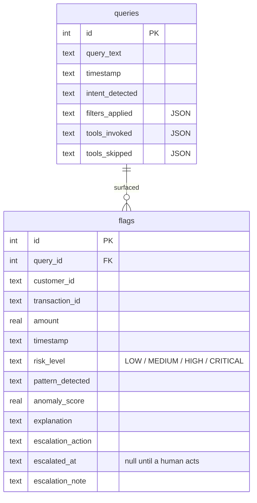

`escalated_at` is what distinguishes "the agent recommended REPORT" from "a human actually clicked
escalate". The table is indexed on `query_id`, `transaction_id` and `customer_id`, and retention
keeps the most recent 500 runs.

---

## Project structure

```
backend/
  main.py                 FastAPI entrypoint, startup key check
  schemas.py              Pydantic AgentResult, the frozen contract
  db.py                   sqlite3: schema, insert, escalate, stats, retention
  agent/
    loop.py               the tool-calling loop, system prompt, flag recovery
    providers.py          Gemini client, get_client() -> chat_with_tools
  api/routes/agent.py     the six routes, SSE streaming
  ml/
    tools.py              TOOL_SCHEMAS + dispatch, the hand-off surface
    eda.py                constrained DuckDB query catalogue
    feature_eng.py        on-demand scoped features
    anomaly.py            3 detectors + rule-hit join, percentile calibration
    risk.py               blend, thresholds, escalation mapping
    explain.py            template-per-motif explanations
    rules.py              the 8 graph motif rules
    features.py           feature spec shared by fit and score
    dates.py              caller-date normalisation
    cache.py              lru_cache over JSON-canonicalised args
    data.py               DATA_DIR paths + shared DuckDB connection
    validation.py         tool argument validation
  scripts/
    enrich.py             raw CSV -> enriched Parquet
    train_models.py       -> models/*.joblib + metadata.json
    build_rule_hits.py    -> Rule_Hits.parquet
    validate_risk_levels.py   precision/recall against ground truth
    tune_blend.py         constant search
    live_check.py         one end-to-end run against the live API
  notebooks/01_exploration.ipynb    Phase 1 EDA
  docs/                   ml_spec.md, phase1.md through phase7.md, ml_audit.md
  tests/                  16 test modules
frontend/src/
  App.tsx                 three tabs, streaming state
  api.ts                  fetch + SSE client
  components/             chat, execution summary, flagged table, charts, dashboard, escalations
spec.md                   the project spec and full decisions log
```

---

## Testing

```bash
cd backend  && python -m pytest -q     # 423 passed, 7 skipped
cd frontend && npm test                # 10 passed
```

The 7 skips are live-API tests. Run them with `VIGIL_LIVE_TESTS=1` and a real key. They spend
quota, since one `/analyze` is several model calls.

Coverage spans the tool contract (a hallucinated argument must be rejected rather than silently
dropped), each of the 8 motif rules with synthetic sequences that should and should not fire them,
risk classification invariants such as the detectors alone never reaching CRITICAL, date
normalisation, cache isolation, the agent loop's recovery paths, and the routes.

---

## Known limitations

Better to state these here than have a judge find them mid-demo.

CRITICAL precision is somewhere between about 20% and 100%, not 100%. No clean account in a
2,000-account sample reached CRITICAL, so there are no observed false positives to estimate from,
and both the point estimate and the bootstrap collapse to 100%. The rule-of-three lower bound is
about 20%.

Detection is intrinsically weak at this base rate. The detectors reach roughly 2.3x lift over a
0.1% base rate, and only 2 of the 8 rules are strong. Recall at HIGH+ is 66%, so most laundering in
this dataset is not caught. The rules carry the signal, not the detectors.

MEDIUM and HIGH both map to `REVIEW`, so tuning improved the ordering inside the review queue
without shrinking it. About 62% of accounts still land at REVIEW-or-above.

`gemini-flash-lite` follows routing instructions imperfectly. A pattern search may flag one account
where three were asked for, and some phrasings route to the wrong tool. A larger model fixes this
at the cost of a much smaller free-tier quota.

Free-tier quota is small. One query is several model calls, so a `429` in the UI is the quota
rather than a fault.

The escalation record is single-layer. `POST /escalate` overwrites `escalation_action` with the
human's choice, so "agent said REPORT, human downgraded to REVIEW" is not preserved. A third column
would fix it, and it was deliberately left out of a single-run demo audit log.

It runs locally only, with no auth, no deployment and a single user, by explicit scope decision.

---

## Data sources

| Source | Use | Licence / access |
|---|---|---|
| [IBM Transactions for Anti Money Laundering (AML)](https://www.kaggle.com/datasets/ealtman2019/ibm-transactions-for-anti-money-laundering-aml), `HI-Small` split | The entire transaction, account and pattern corpus. Synthetic, published by IBM on Kaggle. | Kaggle, manual download. Not redistributed in this repo. |
| Google Gemini API (`gemini-flash-lite-latest`) | The agent's reasoning and tool-selection engine at query time. | AI Studio free tier, key supplied by the operator via `GOOGLE_API_KEY` in `.env`. |

No other external data source is used. No third-party AML watchlist, sanctions list or external API
is consulted at query time. Every number quoted in this README is computed from the Kaggle dataset
by scripts in `backend/scripts/`.

### Model disclosure

The agent runs on Google Gemini, model alias `gemini-flash-lite-latest`. The alias is deliberate
rather than a pinned version: pinned 2.0 and 2.5 model ids return 404 or a zero-quota 429 on new
free-tier keys, and `gemini-flash-latest` allows only 20 requests per day, which one query can
spend a quarter of. Flash-lite has a separate and far larger daily bucket, plus lower latency
across the several sequential calls one run makes.

`agent/providers.py` is the only module that imports the SDK. The loop speaks its own message
shape and never sees a Gemini type, which is what lets the whole agent be tested against a fake
client with no key and no network.

## AI tool disclosure

Claude Code was used as a development-time coding assistant while writing this repository, and is
disclosed here per competition rule 3. It is a dev-time tool only. It does not run at query time
and is not part of the shipped system. The runtime agent is the hand-rolled loop in
`backend/agent/loop.py` calling the Gemini SDK.

---

## Further reading

- [`spec.md`](spec.md) covers the project spec and the full decisions log, including every reversal and why
- [`backend/docs/ml_spec.md`](backend/docs/ml_spec.md) covers the ML workstream: phases, resolved decisions, validation
- [`backend/docs/phase1.md`](backend/docs/phase1.md) is the complete dataset profile
- [`backend/docs/phase4.md`](backend/docs/phase4.md) has the detector and rule measurements
